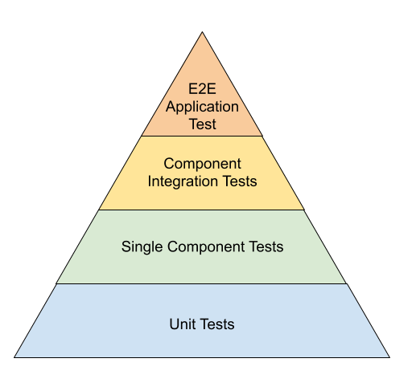
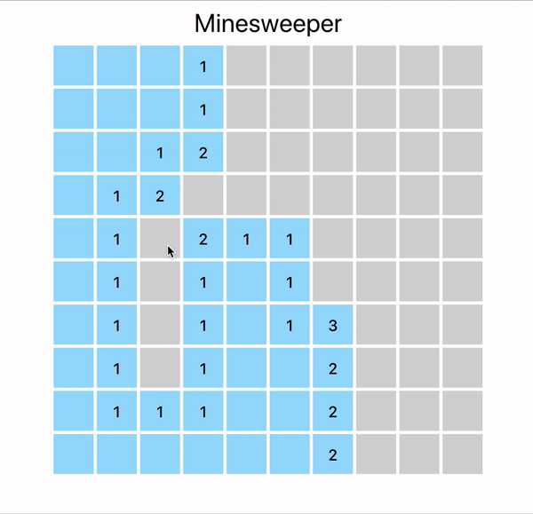

# Testing Single Page Applications

There are many ways to test the frontend of a web application. Most widely used has been to test application as a user would use using Selenium Webdriver or similar libraries. This meant that you have to write test for each and every scenario as a user workflow.

This made our very test slow and delayed the whole Test Driven Development cycle. That lead most UI developers to only write their code and let the UI Automation teams writing test for them.

It is not difficult to see then that dependency on multiple teams
delayed the feedback cycle. Thus delaying the continuous delivery process.

But today we are mainly going focus on testing Single Page Applications (SPA).

Modern SPA frameworks like React, Angular and Vue.js use component based approach to build UI by composing smaller components together. This provides us an opportunity to test our application logic at component level as well as the complete app as a black box.

Because of this granularity of modern SPA testing our testing pyramid would usually look like following:



Lets look at each one of them from top to bottom. To demonstrate various types of tests, I have created a [sample implementation of a MineSweeper Game in React](https://github.com/phudekar/ui-testing).



### 1. Unit Tests:

These are your tests for plain old Javascript functions and classes that you are writing as part of the application. These may include any domain classes, functional utilities or more specifically the helper functions of the UI components. Because these tests usually don't depend on any other code or library you should be able to write test each and every use case of these functions. There are many framework available in Javascript to test this kind of Javascript objects. Most commonly used are [Jasmine](https://jasmine.github.io/), [Mocha](https://mochajs.org/) and [Jest](https://jestjs.io/).

Test under `src/lib` are an example of Javascript unit tests. These test are independent of the UI rendering context that is using these library classes.

eg.
```typescript
it('should explode if it has mine', () => {
    const mine = true;
    const block = new Block(new Position(1, 1), mine);
    const { mineExploded } = block.reveal([]);
    expect(mineExploded).toBeTruthy();
})

it('should not explode if it does not have mine', () => {
    const block = new Block(new Position(1, 1));
    const { mineExploded } = block.reveal([]);
    expect(mineExploded).toBeFalsy();
})
```

### 2. Single Component Tests:

By definition UI components are supposed to be individual building blocks of your applications. These should encapsulate all the logic necessary to render and behave in isolation of other components. If you are using writing Pure components, that means that their behavior is predication and depends only on the properties passed to them, then we can render that component in our test environment without the boilerplate code of rest of the application. Then we can test all kind of use case by changing the properties of this component. You can use testing frameworks [Testing Library](https://testing-library.com/) or [Enzyme](https://enzymejs.github.io/enzyme/) which work with `react-dom` to test individual component. 

`src/game/Block.test.ts`is a good example of testing a single component without any other application context.

```typescript
it('should call onRevealed after left click', () => {
    const block = new Block(position);
    const reveal = jest.fn();

    const { getByTestId } = render(<BlockComponent block={block} onReveal={reveal} />);

    const root = getByTestId(`block-${position.row}-${position.column}`);
    fireEvent.click(root);

    expect(reveal).toHaveBeenCalled();
})

it('should call toggleFlagged after right click', () => {
    const block = new Block(position);
    const toggleFlagged = jest.fn();

    const { getByTestId } = render(<BlockComponent block={block} toggleFlagged={toggleFlagged} />);

    const root = getByTestId(`block-${position.row}-${position.column}`);

    fireEvent.contextMenu(root);

    expect(toggleFlagged).toHaveBeenCalled();
})

it('should show bomb if revealed and exploded', () => {
    const { container } = render(
        <BlockComponent block={{ revealed: true, exploded: true }} />
    );

    expect(container.querySelector('.bomb')).toBeVisible();
})
```

Here you can also use shallow rendering *(ie. Just render the component under test without rendering any other components that you may have used as its children)*. Shallow rendering is beneficial when you want to test the internal logic of a component in isolation.

### 3. Component Integration Tests
After we test each component in isolation it is time to check if components are being used properly in the context of another component. In previous step we were rendering and testing only one component, but if ware want to make sure that component is passing correct data to child component and handling event raised by children then we must rendering our component with all its children without mocking them. This may seem that we are now dependent on the child components but thats precisely what we want to test. This kind of tests helps us find any integration issues between dependent components.

In our code example, the `src/game/Board.test.tsx` is an example of Component Integration Test. The *Board* component uses *Block* component.

```typescript
it('should reveal block', () => {
    const rows = 5;
    const columns = 5;
    const board = new Board(rows, columns);
    const { container } = render(<BoardComponent board={board} />)

    const block = container.querySelectorAll('.block')[0];
    fireEvent.click(block);

    expect(board.blocks[0][0].revealed).toBe(true);
})

 it('should call game over on mine explode', () => {
    const rows = 5;
    const columns = 5;
    const board = new Board(rows, columns);
    board.plantMines([new Position(0, 0)]);

    const gameOver = jest.fn();

    const { container } = render(<BoardComponent board={board} onGameOver={gameOver} />)

    const blockWithMine = container.querySelectorAll('.block')[0];
    fireEvent.click(blockWithMine);

    expect(gameOver).toHaveBeenCalled();

})

```

### 4. End to End Tests:

After testing all our components in isolation of groups we still need to make sure that our app works end to end without stubbing any of its components. The goal of end to end (e2e) tests is to test our app as an user. We can not assume any internals of the applications. We should treat it as a complete black box and assert the behaviour completely on the outcome of user actions.

As part of our previous steps to test various use cases of each individual components in unit or integration tests, e2e test don't need to cover all the scenarios. Ideally we should write only few e2e tests to check the overall sanity of the app. Because we are testing our app as an end user we should execute our tests by rendering our SAP in a real browser. The can sometime cause e2e tests to take more time compared to its counterparts. 

There are many ways to execute e2e tests in browser, for example using [Selenium Web Driver](https://www.selenium.dev/documentation/en/getting_started_with_webdriver/), [Puppeteer](https://developers.google.com/web/tools/puppeteer) or [Cypress](https://www.cypress.io/)

In our example project I have used Cypress to run my e2e scenario in chrome browser. The Cypress tests are located under `cypress/integration/minesweeper/`.

An typical cypress test looks like:

```typescript
it('should toggle flag of a block', () => {
    cy.visit("/");

    cy.get(".flag")
        .should("not.be.visible");

    const block = cy.get(".block").first();

    block.rightclick();

    cy.get(".flag")
        .should("be.visible");

    block.rightclick();

    cy.get(".flag")
        .should("not.be.visible");
})

``` 